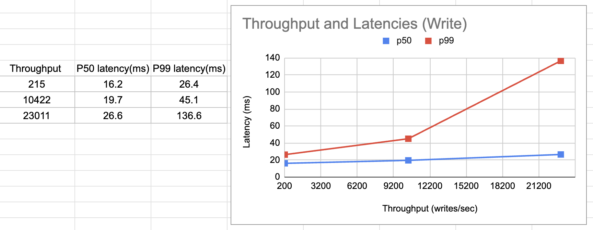
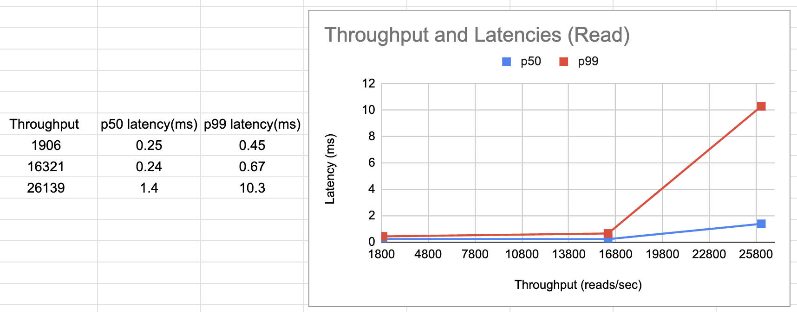

## High performance
Goblin provide stable, sustained high performance. Two factors define performance: latency and throughput. Latency is the time taken to complete an operation. Throughput is the total operations completed within some time period.

### Physical Node
| Node SKU | Memory | Processor Count | NIC Count | NIC Throughput |Disk |
|--------|---------|------------------|----------|-----------------|----|
| P3G6 | 384GB | 48 | 2 | 10Gb/s (1GB/s) | 2T * 3 SSD |

### Container Resource
| CPU | Memory | Disk |
| --- | -------|------|
| 15-10 | 150G-100G | PVC - local dynamic, SSD 500G |

### Goblin Server Parameters

| Vital parameters                | Value|
|---------------------------------|------|
| CPL threads                     | 16|
| Receive threads                 | 8| 
|  Reply threads                   | 5 read, 5 write, 10 metrics| 
|  LRU Capacity                    | 15G| 
|  Persist Queue Max Batch Size    | 100| 
|  Persist Queue Max Batch Latency | 5ms| 
| Raft AE Max Delay Time          | 10ms| 
| Raft AE max payload             | 50M| 
| Raft AE max size                | 2000| 

Since the system implemented based on Raft needs to replicate Raft logs Cross data centers, the request latency will be affected by the RTT(Round Trip Time) between data centers. Basically, there are two kinds of deployments for a five nodes Goblin cluster:
|Type |Deployments | Nodes Distribution | RTT|
|-----|----------|---------------|-----------|
|Cross DC|3 data center| 2-2-1| about 10ms|
|Same DC|Same data center| 5 | < 1ms |

Performance metrics below are all based on payload size 1KB.
### Extreme Performance on "Cross DC" Deployment
|Test Case | QPS/TPS | P99 Latency| P50 Latency|
|----------|-----|-------------------------|------------------------|
|Leader Write | 23k |136ms | 26ms|
|Leader Read | 26k | 10ms | 1.38ms|
|Follower Read | 10.3w | 1.07ms | 0.24ms|
|Leader Read Exist & Write | Write: 3.8k Read: 24.4k | Write: 38ms Read: 13.4ms | Write: 20.3ms Read: 1ms|
|Leader Read Nonexist & Write | Write: 3.3k Read: 24k | Write: 38.5ms Read: 25.6ms | Write: 20s Read: 3.6ms|
|Leader Delete | 25k | 39ms | 25.3ms|

### Low Pressure Performance on "Same DC" Deployment
| Test Case                    | QPS/TPS | P99 Latency| P50 Latency|
|------------------------------|-----|-------------------------|------------------------|
| Leader Write                 | 319 | 21ms | 8ms|
|  Leader Read Exist & Write    | Write: 335 Read: 1846 | Write: 21.6ms Read: 0.35ms | Write: 8.4ms Read: 0.06ms| 
|  Leader Read Nonexist & Write | Write: 336 Read: 1881 | Write: 21.6ms Read: 0.36ms | Write: 8.4ms Read: 0.07ms| 
| Leader Delete                | 317 | 20.7ms | 8ms|

### Low Pressure Performance on "Cross DC" Deployment
| Test Case                    | QPS/TPS | P99 Latency| P50 Latency|
|------------------------------|-----|-------------------------|------------------------|
| Leader Write                 | 215 | 26.4ms | 16.2ms| 
|  Leader Read                  | 1906 | 0.45ms | 0.25ms| 
|  Follower Read                | 5105 | 0.53ms | 0.26ms| 
|  Leader Read Exist & Write    | Write: 228 Read: 1904 | Write: 25.6ms Read: 0.41ms | Write: 18.2ms Read: 0.24ms| 
|  Leader Read Nonexist & Write | Write: 227 Read: 1911 | Write: 26ms Read: 0.4ms | Write: 18.2ms Read: 0.24ms| 
| Leader Delete                | 225 | 26ms | 16ms| 

### Performance Tendency
#### Workload at 100% Write

#### Workload at 100% Read
