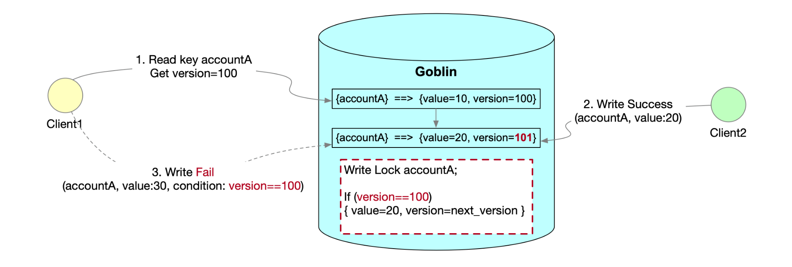

# CAS (compare-and-swap)
## Introduction
CAS (compare-and-swap) is a mechanism that allows you to update a key-value pair only if the current value matches the expected value.
## API
The basic CAS (Compare And Swap) API is
```java
CasResponse cas(CasRequest request) throws GoblinException;
```
CasRequest:

| Field           | Type      | Remark                                                                                                                                                   |
|-----------------|-----------|----------------------------------------------------------------------------------------------------------------------------------------------------------|
| key             | KeyType   | The key to be put into Goblin                                                                                                                            |
| value           | ValueType | The value to be put into Goblin with respect to key                                                                                                      |
| enableTTL       | Boolean   | true: TTL (time to live) will be enabled for the key<br>false: no TTL will be enabled for the key                                                        |
| ttl             | Integer   | The TTL for the key (in seconds, should be larger than zero), if enableTTL is true.<br>This value could be null to reset the start time of the last TTL. |
| comparedVersion | Long      | Only update the value for the key if the latest version in Goblin equals to comparedVersion.<br>Otherwise, throw a GoblinConditionNotMetException.       |

CasResponse:

| Field   | Type   | Remark                                          |
|---------|--------|-------------------------------------------------|
| version | Long   | The version of the key that was put into Goblin |

### Shortcut CAS APIs
CAS without TTL
```java
CasResponse cas(KeyType key, ValueType value, long comparedVersion) throws GoblinException;
```
CAS with a defined TTL
```java
CasResponse casWithTTL(KeyType key, ValueType value, long comparedVersion, Integer ttl) throws GoblinException;
```
CAS with the last TTL, reset the start time of the TTL
```java
CasResponse casWithTTL(KeyType key, ValueType value, long comparedVersion) throws GoblinException;
```

## Design


## How it works
1. When client updates a key-value pair, it sets an expected version of the target key as a condition in the request. 
2. Server checks if the current version of the key matches the expected version. If yes, server updates the key-value pair and returns true to the client. 
Otherwise, server returns false to the client.
