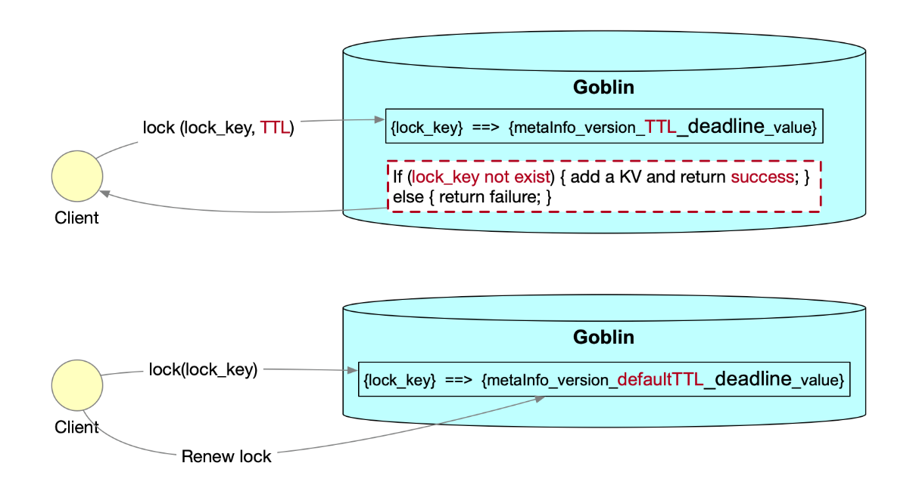

# Distributed Lock
## Introduction
We have a lock API that allows multiple clients to compete for a distributed lock based on a specific key and only one client can get the lock as a successful result. 
This lock can either be explicitly released by the client or automatically released after connection is broken.

## API
The basic Lock API is
```java
boolean lock(LockRequest request) throws GoblinException;
boolean unlock(KeyType key) throws GoblinException;
```
LockRequest:

| Field | Type      | Remark                                                       |
|-------|-----------|--------------------------------------------------------------|
| key   | KeyType   | The key to be get from Goblin                                |
| value | ValueType | The value to be put into Goblin with respect to key          |
| ttl   | boolean   | The TTL for the key (in seconds, should be larger than zero) |

### Shortcut Lock APIs
try to acquire lock on the key with a random value, and it will be extended automatically. Return true if succeeded
```java
boolean lock(KeyType key) throws GoblinException;
```
try to acquire lock on the key with a random value, set ttl to be expired. Return true if succeeded
```java
boolean lock(KeyType key, Integer timeout) throws GoblinException;
```
try to acquire lock on the key with a value, set ttl to be expired. Return true if succeeded. You can put a value with the key, and then get the value by key through query API later before the ttl.
```java
boolean lock(KeyType key, ValueType value, Integer timeout) throws GoblinException;
```
try to release lock. Return true on success
```java
boolean unlock(String key) throws GoblinException;
```

## Design


1. Distributed lock is implemented by writing a KV with TTL
2. Clients compete for the lock by writing the same key. Only one client can successfully write the KV, and it gets the lock.
3. Client can specify a TTL for the lock. If the client crashes, the lock will be released after TTL.
4. If client doesn't provide TTL, server will give it a default one (20s), and client renews the lock periodically and automatically in the client library.
5. Even if the leader crashes, distributed lock still takes effective in the new leader, since the KV is replicated among all servers.

## How it works
The distributed lock of Goblin is implemented based on putIfNotExists with TTL. The mechanism is handled by Goblin server and client lib, end user doesn't need to care about it.

### put-if-not-exists to obtain a lock
Once a client requests for a distributed lock based on a specific key, the server will first check if this key exists. 
If not, it indicates the lock is not holden by any other client, and could be successfully acquired by this client. 
Meanwhile, this specific key is now persisted in the server (KV Store) that prevent others accessing the lock before being released. 
The check and put operations are within one single transaction. 
After succeeding in lock, this client could operate the data within the lock session. 
Otherwise, if the key exists, the lock request fails immediately, as the lock has already been holden by some other client.

The TTL (time-to-live) could be explicitly specified for the lock. 
And the lock will be automatically released after TTL. 
Without TTL set, by default the lock will be extended automatically unless the unlock request is invoked or any network issue occurs. 

### delete-if-version-matches to release a lock
A monotonically increasing global version is recorded in the server on each key modification (write/delete) operation. 
And the client stub will maintain the version for the key write/delete, carried in each server response.

Therefore, the client that acquires the lock successfully will also get such version in the lock response from the server, and record it as the lock's identity. 
When this client expects to release the lock, it will include this lock version in the unlock request. 
Once the server receives this unlock request, it will first check if the requested version matches the key's current version. 
If yes, it means the key is not changed(locked) by other threads, and the server will safely release the lock via a simple deletion operation. 
Otherwise, the unlock request will be rejected as the current lock recorded in the server is not owned by that client of the request.

## Note
1. When the client crashes, the Leader server will release the lock after ttl. If no ttl assigned in the parameter, server gives the ttl a default value which is 20 seconds.
2. When the Leader server crashes, the other server will become leader (normal within 1s). And the leader change is transparent to the client. Client can work normally even the leader changes.