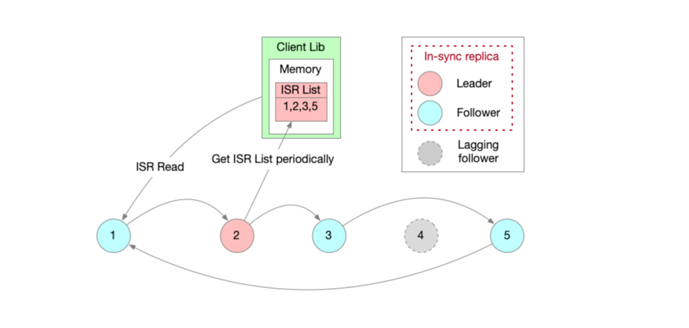

# ISR (Insync Replica Read)
## Introduction
ISR (Insync Replica Read) is a mechanism that allows you to read from a replica that is in sync with the leader.
A Goblin cluster is based on Raft consensus, and has a leader and multiple followers(typically 4 followers). 
The leader is responsible for processing all the requests, and the followers replicate the data from the leader.

For the client which wants to read data from Goblin, it can choose to read from the leader for strong consistency, 
or read from followers for eventual consistency but better throughput. 
Even if the client accept eventual consistency, it doesn't expect to read too stale data. 
So we introduce ISR concept to prevent reading too stale data.

When a follower is in sync with the leader, it means that the gap between the follower and the leader is within a certain threshold.

If a client configures ISR read, the client will read from the followers only when the followers are in sync with the leader.

## Configuration
Users only need a few configuration to turn on the ISR feature. For raptor-io application, configuring goblin.client.pool as ISR in spring configuration files like application.properties will work. A few advanced configurations are supported to enable users to tune the ISR behaviors based on their use scenarios.

| Configuration                      | Remark                                                                                                                                                                      |
|------------------------------------|-----------------------------------------------------------------------------------------------------------------------------------------------------------------------------|
| goblin.client.pool                 | client mode.<br>InSyncReplica: read from in-sync followers<br>RoundRobin: read from followers<br>LeaderOnly: read from leader<br>Default value: InSyncReplica               |
| goblin.client.pool.ISR.minGap      | The threshold to generate the ISR list. Only peers (followers) of which the lag is less than the specified threshold are treated as in-sync replicas.<br>Default value: 100 |
| goblin.client.pool.ISR.refreshTime | Time interval to refresh ISR list.<br> Default value: 2min                                                                                                                  |
| goblin.client.pool.ISR.leaseTime   | Lease for an ISR List becomes invalid.<br> Default value: 10min                                                                                                             |

### Sample Configurations
```properties
goblin.client.pool=InSyncReplica
goblin.client.pool.ISR.minGap=100
goblin.client.pool.ISR.refreshTime=120000
goblin.client.pool.ISR.leaseTime=600000
```

## Design


## How it works
1. Leader exposes all the followers’ offsets in an API.
2. Client gets all the followers’ offsets from leader periodically, and judge whether the gaps are within the threshold, then update the ISR list.
3. Client sends read requests to nodes in ISR list in affinity mode.
4. If client can’t connect to an ISR node, it will mark down it for a while by removing it from ISR list in client’s memory for better availability
