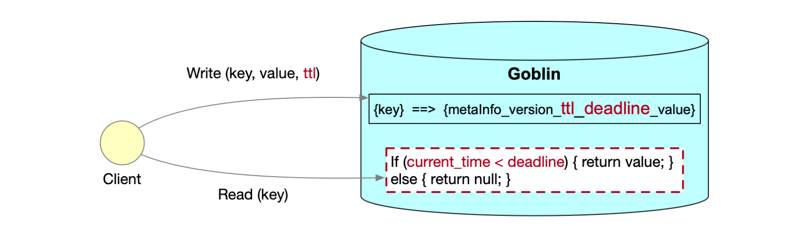

# Key expiration
## Introduction
Key expiration is a mechanism that allows you to set a time-to-live (TTL) value for a key. 
After the TTL value expires, the key will be deleted automatically.

## API
Refer to [Client API Reference](client_api_reference.md) for detail

## Design

## How it works
1. Client specifies a TTL when writing a key-value pair. Server calculates the deadline of the key-value pair and stores it in the key-value store. 
When a client reads a key-value pair, server checks if the deadline is expired. If yes, server returns NULL to the client.
2. The deadline will be updated when new write operations happen on the key-value pair.
3. Expired keys will be deleted by RocksDB compaction job.
