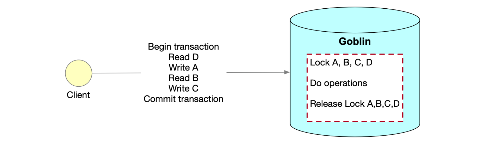

# Transaction
## Introduction
We have some cases that users wish to run multiple operations in one transaction. 
This feature will provide a way that users can start a transaction, run some operations and commit or cancel the transaction. 
This kind of transaction can automatically be canceled if the connection between clients and servers is broken.

## API
The basic MiniTransaction API is
```
MiniTransaction newTransaction() throws GoblinException;
TransResponse commitTransaction(MiniTransaction trans) throws GoblinException;
```
Type: Condition

| Category        | Remark                                                                                                    |
|-----------------|-----------------------------------------------------------------------------------------------------------|
| withVersionCond | check if the version is same as given when executing transaction                                          |
| withExistCond   | check if key exists when executing transaction                                                            |
| withUdfCond     | check if user defined meta of the key meets the pre-defined conditioning logic when executing transaction |

Type: Transaction

| Method   | Remark                          |
|----------|---------------------------------|
| put      | put a kv in this transaction    |
| get      | get a kv in this transaction    |
| delete   | delete a kv in this transaction |

## Example
Here is the example that use mini-transaction to do a balance transfer:
```java
String fromAccount = "UserA";
String toAccount = "UserB";
long balance = 100;
// use a transaction to get balance of A and B at the same time
MiniTransaction txn1 = client.newTransaction();
txn1.get(fromAccount);
txn1.get(toAccount);
TransResponse transResponse = client.commitTransaction(txn1);
GetResponse getResponseA = (GetResponse) transResponse.getResults().get(0);
GetResponse getResponseB = (GetResponse) transResponse.getResults().get(1);

// transfer balance from A to B in one transaction, which only succeed when two balance account don't change
MiniTransaction txn2 = client.newTransaction();
long newBalanceForA = Long.parseLong(new String(getResponseA.getValue().get().getContent())) - balance;
long newBalanceForB = Long.parseLong(new String(getResponseB.getValue().get().getContent())) + balance;
txn2.withVersionCond(fromAccount, getResponseA.getVersion(), CompareOp.EQUAL);
txn2.withVersionCond(toAccount, getResponseB.getVersion(), CompareOp.EQUAL);
txn2.put(fromAccount, newBalanceForA.toString());
txn2.put(toAccount, newBalanceForB.toString());
client.commitTransaction(txn2);
```

## Design


## How it works
1. Client starts a transaction, then do some operations, and finally commits the transaction.
2. Server will take action only when commitTransaction is invoked.
3. When commitTransaction is invoked, server records all the operations in the transaction, and lock the keys in alphabetically to avoid deadlock.
4. Then server will execute the operations in the transaction one by one.
5. All the results in one transaction are persisted in one raft entry to guarantee atomicity.

## Note
1. When precondition is set in newTransaction, the transaction will check if it is matched only when commitTransaction is invoked. 
This is more like a pessimistic locking.
2. When an operation(put/delete) is invoked in a transaction, the related keys will be locked to prevent others to touch on server side.
3. This mini-transaction only exists in the memory of the connected server, and will be cleaned up when server is rebooted. 
User will get exception if commitTransaction is invoked after server is rebooted.
4. Before the commitTransaction returns successfully, it cannot guarantee that the transaction operations succeed.
5. If the client loses connection with the server for commitTransaction, the transaction will be removed and nothing will happen.