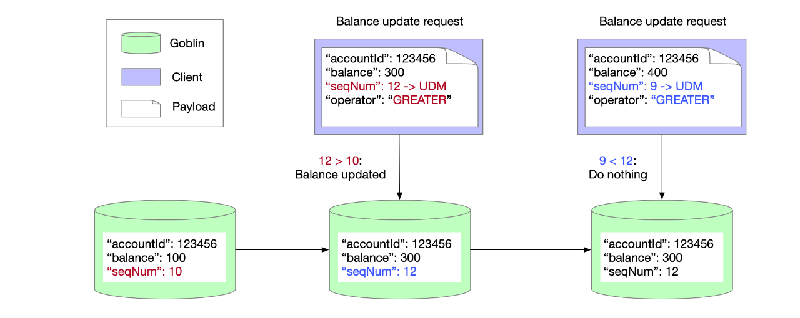

# UDM (User-Defined Meta)
## Introduction
UDM (User-Defined Meta) is a mechanism that allows you to store some metadata in the key-value store.
It provides calculation capability for the metadata, and supports conditional update with atomicity.
It puts down the calculation logic to storage side, which can guarantee the consistency and reduce the network traffic.

## API
Specify the conditioning logic for a `MiniTransaction` associated with the given key's UDM.
```java
void withUdfCond(KeyType key, UserDefinedMeta meta, CompareOp compareOp, UdfMetaType udfMetaType, int pos);
```

| Field       | Type            | Remark                                                                                                    |
|-------------|-----------------|-----------------------------------------------------------------------------------------------------------|
| key         | KeyType         | The key to be get from Goblin                                                                             |
| meta        | UserDefinedMeta | The user-defined meta to be used in the conditioning logic.<br> Integer array lists are supported for now |
| compareOp   | CompareOp       | The operator of the conditioning logic.<br>Supported operators: EQUAL, GREATER, LESS, NOT_EQUAL           |
| udfMetaType | UdfMetaType     | The UDM type.<br> Supported types: NUM                                                                    |
| pos         | int             | The position of the given UDM array list to be used for conditioning.                                     |

Add the put operation with UDM to the `MiniTransaction` request.
```java
void putWithUserDefinedMeta(String key, String value, UserDefinedMeta userDefinedMeta);
```

| Field           | Type            | Remark                                                                                                                                                                                                                        |
|-----------------|-----------------|-------------------------------------------------------------------------------------------------------------------------------------------------------------------------------------------------------------------------------|
| key             | KeyType         | The key to be get from Goblin                                                                                                                                                                                                 |
| value           | String          | The value to be put into Goblin with respect to key.<br>If the conditioning logic is met, the new value will be stored in the server.<br>Otherwise, it will be unchanged                                                      |
| userDefinedMeta | UserDefinedMeta | The user-defined meta to be used in he conditioning logic.<br> Integer array lists are supported for now.<br>If the conditioning logic is met, the new UDM will be stored in the server.<br>Otherwise, it will be unchanged   |

## Example
```java
// test user meta condition succeeded if the key is not present or if no UDM was defined previously
MiniTransaction txn1 = client.newTransaction();
List<Long> uintMeta = new ArrayList<>();
uintMeta.add(123L);
UserDefinedMeta userDefinedMeta = UserDefinedMeta.builder().uintField(uintMeta).build();
txn1.withUdfCond(KeyType.builder().key("testTrans").build(), userDefinedMeta, CompareOp.GREATER, UdfMetaType.NUM, 0);
txn1.putWithUserDefinedMeta("testTrans", "testTransValue", userDefinedMeta);
txn1.get("testTrans");
TransResponse transResponse1 = client.commitTransaction(txn1);
assertArrayEquals(getResponse1.getValue().get().getContent(), "testTransValue".getBytes());

// test user meta condition failed
MiniTransaction txn2 = client.newTransaction();
List<Long> uintMeta_ignore = new ArrayList<>();
uintMeta_ignore.add(122L);
UserDefinedMeta userDefinedMeta_ignore = UserDefinedMeta.builder().uintField(uintMeta_ignore).build();
txn2.withUdfCond(KeyType.builder().key("testTrans").build(), userDefinedMeta_ignore, CompareOp.GREATER, UdfMetaType.NUM, 0);
txn2.putWithUserDefinedMeta("testTrans", "testTransValue_ignore", userDefinedMeta_ignore);
txn2.get("testTrans");
TransResponse transResponse2 = client.commitTransaction(txn2);
GetResponse getResponse2 = (GetResponse) transResponse2.getResults().get(1);
assertArrayEquals(getResponse2.getValue().get().getContent(), "testTransValue".getBytes());

// test user meta condition succeeded
MiniTransaction txn3 = client.newTransaction();
List<Long> uintMeta_succeed = new ArrayList<>();
uintMeta_succeed.add(124L);
UserDefinedMeta userDefinedMeta_succeed = UserDefinedMeta.builder().uintField(uintMeta_succeed).build();
txn3.withUdfCond(KeyType.builder().key("testTrans").build(), userDefinedMeta_succeed, CompareOp.GREATER, UdfMetaType.NUM, 0);
txn3.putWithUserDefinedMeta("testTrans", "testTransValue_succeed", userDefinedMeta_succeed);
txn3.get("testTrans");
TransResponse transResponse3 = client.commitTransaction(txn3);
GetResponse getResponse3 = (GetResponse) transResponse3.getResults().get(1);
assertArrayEquals(getResponse3.getValue().get().getContent(), "testTransValue_succeed".getBytes());
```

## How it works


In order to keep the latest account balances in Goblin, we update balance for an account on condition that the target seqNum in the request is bigger than the existing one.

In the client request 
- Specify “seqNum” as a UDM
- Specify an operator “GREATER”

Goblin server will
- if (seqNum_in_request > existing_one) {updateBalance();}
- else {doNothing();}

## Note
If you invoke txn.withUdfCond(...) and txn.putWithUserDefinedMeta(...) on a key in a transaction, but the key doesn't exist in Goblin or with no udm defined before, the put operation will be executed successfully with UDM by ignoring the condition.
